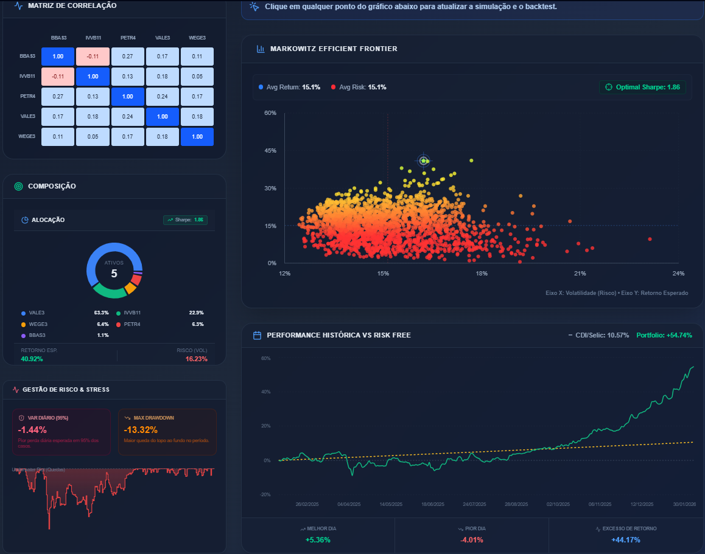

# Quantitative Portfolio Optimizer 📈

Uma plataforma Fullstack de finanças quantitativas desenvolvida para simular, otimizar e analisar portfólios de investimento utilizando a Teoria Moderna do Portfólio (Markowitz Framework).


## 📸 Dashboards

<div align="center">
  
</div>

## 🎯 Principais Funcionalidades

- **Fronteira Eficiente:** Simulações de Monte Carlo para encontrar o equilíbrio ideal entre risco e retorno.
- **Otimização em Tempo Real:** Cálculo dinâmico do portfólio com o melhor *Sharpe Ratio*.
- **Análise de VaR:** Cálculo de *Value at Risk* (Paramétrico e Histórico) para gestão de risco.
- **Backtesting Engine:** Comparação da performance histórica do portfólio otimizado contra benchmarks brasileiros (CDI/Selic).
- **Matriz de Correlação:** Visualização em heatmap das dependências entre os ativos.

## 🛠️ Tech Stack

### Frontend
- **Framework:** Next.js 14 (App Router)
- **Estilização:** Tailwind CSS (Design Responsivo & Dark Mode)
- **Visualização:** Recharts (Gráficos Interativos)
- **Linguagem:** TypeScript

### Backend (Quantitative Core)
- **Framework:** FastAPI (Python)
- **Fonte de Dados:** Yahoo Finance (yfinance)
- **Bibliotecas:** Pandas, NumPy, Scikit-learn (Modelagem de Risco)

### DevOps & Infraestrutura
- **Containerização:** Docker & Docker Compose
- **Servidor:** Nginx Reverse Proxy
- **CI/CD:** Dockerfile otimizado para produção

## 🚀 Como Executar

### Pré-requisitos
- Docker & Docker Compose instalados na máquina.

### Instalação

1. **Clone o repositório:**
   ```bash
   git clone [https://github.com/SEU_USUARIO/portfolio-optimizer.git](https://github.com/SEU_USUARIO/portfolio-optimizer.git)
   cd portfolio-optimizer

2. **Configure as variáveis de ambiente:**
   Crie o arquivo `.env` baseando-se no exemplo.
   ```bash
   cp .env.example .env

3. **Execute com Docker Compose:**
   Este comando irá construir os containers e iniciar a aplicação.
   ```bash
   docker compose up -d --build

## 📊 Metodologia

Este projeto implementa a **Otimização de Média-Variância de Markowitz**. O modelo assume que os retornos dos ativos são normalmente distribuídos e calcula a variância do portfólio com base na matriz de covariância dos retornos.

- **Taxa Livre de Risco (Risk Free):** Ajustada automaticamente para o mercado brasileiro (convenção de 252 dias úteis).
- **Alvo da Otimização:** Maximizar o Índice de Sharpe ($R_p - R_f / \sigma_p$).

## 👨‍💻 Autor

**Matheus Rocha**  
*Economista | Especialista em Tesouraria | Fullstack Developer*

Unindo finanças quantitativas e engenharia de software para construir soluções **fintech escaláveis**.

🔗 Conecte-se:
- LinkedIn: https://www.linkedin.com/in/matheus-rocha-4a616320a/  
- Portfólio: https://matheusrocha.cloud  

---

© 2026 Credit Risk Intelligence Platform. Todos os direitos reservados.